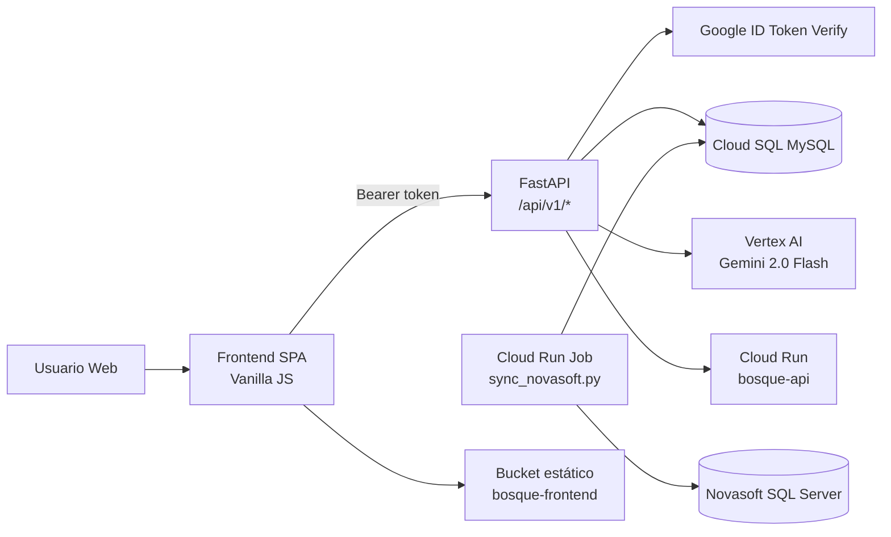

# GUADUA

Plataforma web para planeación, control y auditoría de nómina del Instituto Alexander von Humboldt.

GUADUA combina:
- autenticación corporativa con Google,
- analítica de nómina y financiación,
- gestión de vacantes y solicitudes,
- y un asistente IA (GuaduAI) con consultas en lenguaje natural sobre la base de datos.

> Nota de naming: el producto es **GUADUA**, pero varios recursos técnicos conservan el nombre histórico **bosque** (`bosque-api`, bucket `bosque-frontend`, proyecto GCP `bosque-485105`).

## Tabla de Contenido

1. [Visión General](#visión-general)
2. [Arquitectura](#arquitectura)
3. [Módulos Funcionales](#módulos-funcionales)
4. [Stack Tecnológico](#stack-tecnológico)
5. [Estructura del Repositorio](#estructura-del-repositorio)
6. [Requisitos Previos](#requisitos-previos)
7. [Configuración Sensible](#configuración-sensible)
8. [Ejecución Local](#ejecución-local)
9. [API y Endpoints Clave](#api-y-endpoints-clave)
10. [Roles y Permisos](#roles-y-permisos)
11. [Sincronización con Novasoft](#sincronización-con-novasoft)
12. [Despliegue a Producción](#despliegue-a-producción)
13. [Troubleshooting](#troubleshooting)
14. [Buenas Prácticas de Seguridad](#buenas-prácticas-de-seguridad)

## Visión General

GUADUA está diseñada para centralizar operaciones de nómina y presupuesto:

- Consulta individual por colaborador con detalle de contratos y tramos de financiación.
- Dashboard ejecutivo de costos, flujo y proyección mensualizada.
- Gestión de vacantes y posiciones institucionales.
- Flujo de solicitudes de cambio presupuestal con aprobación/rechazo.
- Módulo de nómina real (carga, conciliación y dashboard).
- Bitácora de auditoría para trazabilidad de acciones.
- Chatbot IA (`/api/v1/ai/query`) para exploración de datos con lenguaje natural.

## Arquitectura



## Módulos Funcionales

- **Autenticación y sesión**: Google Sign-In + validación de dominio + whitelist (`BWhitelist`).
- **Dashboard global**: indicadores financieros, mensualización, flujo de caja, reporte CARS.
- **Consulta individual**: historial por cédula, financiación y proyección.
- **Financiero/Presupuesto**: snapshots, comparación de versiones, solicitudes y aprobaciones.
- **Nómina**: carga de archivos, resumen, reconciliación y tablero de ejecución.
- **Vacantes**: inventario de posiciones vacantes y simulación de impacto.
- **Administración**: whitelist, tablas maestras, posiciones, incrementos.
- **Auditoría**: consulta de eventos y métricas de trazabilidad.
- **GuaduAI**: consultas en lenguaje natural sobre tablas de negocio.

## Stack Tecnológico

- **Backend**: FastAPI, SQLAlchemy, PyMySQL, Pydantic.
- **IA**: LangChain + Vertex AI (`gemini-2.0-flash`).
- **Frontend**: SPA con JavaScript modular (sin framework), CSS, Tabulator, SheetJS.
- **Datos**: Cloud SQL (MySQL) + integración Novasoft (SQL Server vía `pyodbc`).
- **Infraestructura**: Google Cloud Run (servicio + job), Artifact Registry, Cloud Storage.

## Estructura del Repositorio

```text
.
├── backend/
│   ├── app/
│   │   ├── api/v1/endpoints/      # Endpoints de negocio
│   │   ├── core/                  # Config, seguridad, DB
│   │   ├── services/              # Servicios (incluye IA)
│   │   └── main.py                # App FastAPI + static mount
│   ├── sync_novasoft.py           # Sincronización ERP -> Cloud SQL
│   ├── requirements.txt
│   └── Dockerfile
├── frontend/
│   ├── Index.html
│   ├── css/
│   ├── js/
│   │   └── modules/
│   └── assets/
├── run_local.sh / run_local.ps1   # Orquestación local
├── deploy_prod.sh / deploy_prod.ps1
├── env.yaml                       # Plantilla (placeholders)
└── README.md
```

## Requisitos Previos

- Python `3.10+` (recomendado `3.11`).
- `gcloud` CLI autenticado.
- `gsutil` disponible.
- Cloud SQL Proxy en la raíz del repo:
  - macOS/Linux: `cloud-sql-proxy`
  - Windows: `cloud-sql-proxy.exe`
- Para sincronización Novasoft: driver ODBC SQL Server (`msodbcsql17` o equivalente).

## Configuración Sensible

La configuración de credenciales y secretos es **privada**.

- Usa `.env.local` para ejecución local (archivo no versionado).
- Usa `env.yaml` solo como plantilla con placeholders, nunca con secretos reales.
- Gestiona credenciales de producción en un gestor seguro (Secret Manager o equivalente).
- No publiques valores de configuración sensible en documentación, tickets, capturas o commits.

## Ejecución Local

### Opción 1: script automatizado (macOS/Linux)

```bash
python3 -m venv .venv
source .venv/bin/activate
pip install -r requirements.txt

# opcional pero recomendado para auth ADC
gcloud auth application-default login

./run_local.sh
```

Servicios iniciados por script:
- Cloud SQL Proxy: `127.0.0.1:3306`
- Backend: `http://localhost:8000` (`/docs` disponible)
- Frontend: `http://localhost:8080`

### Opción 2: script automatizado (Windows PowerShell)

```powershell
python -m venv .venv
.\.venv\Scripts\Activate.ps1
pip install -r requirements.txt

.\run_local.ps1
```

### Modo desarrollador local (sin Google real)

Existe un modo de bypass para entorno local. Actívalo únicamente en desarrollo y nunca en producción.

## API y Endpoints Clave

Base path: `/api/v1`

- `GET /employees/me`
- `GET /employees/consulta/{cedula}`
- `GET /admin/dashboard-global`
- `GET /admin/reporte-detallado`
- `GET /admin/flujo-caja`
- `POST /admin/nomina/upload`
- `GET /admin/nomina/dashboard`
- `POST /admin/presupuesto/solicitudes`
- `POST /admin/presupuesto/solicitudes/{req_id}/aprobar`
- `POST /admin/presupuesto/solicitudes/{req_id}/rechazar`
- `GET /vacantes/dashboard`
- `POST /ai/query`

Documentación interactiva (OpenAPI):
- `http://localhost:8000/docs`

## Roles y Permisos

Roles soportados por backend:
- `admin`
- `financiero`
- `talento`
- `nomina`
- `user`

Resumen de acceso funcional:

- **admin**: acceso total (incluye auditoría, administración, IA, nómina, vacantes, solicitudes).
- **financiero**: dashboard/financiero, solicitudes, nómina consulta, IA.
- **talento**: vacantes, consulta, financiero base, IA.
- **nomina**: nómina, vacantes, solicitudes, consulta operativa.
- **user**: consulta general y vistas permitidas por endpoint.

> El frontend oculta navegación por rol, pero la seguridad real está en backend con `require_role(...)`.

## Sincronización con Novasoft

Script principal:
- `backend/sync_novasoft.py`

Objetivo:
- Cargar catálogos desde Novasoft SQL Server hacia Cloud SQL (`dim_proyectos`, `dim_fuentes`, `dim_componentes`, etc.).
- Inserta solo diferenciales por `codigo`.

Ejecución manual (ejemplo):

```bash
cd backend
../.venv/bin/python sync_novasoft.py
```

En producción este proceso se actualiza como **Cloud Run Job** (`bosque`) durante deploy.

## Despliegue a Producción

Scripts oficiales:
- macOS/Linux: `./deploy_prod.sh`
- Windows: `./deploy_prod.ps1`

Qué hace el deploy:

1. Valida la configuración privada cargada desde `.env.local`.
2. Construye imagen Docker en Artifact Registry.
3. Despliega servicio Cloud Run `bosque-api`.
4. Actualiza Cloud Run Job `bosque` para sincronización.
5. Publica frontend en bucket `gs://bosque-frontend` con metadatos correctos.

Comando recomendado (macOS/Linux):

```bash
./deploy_prod.sh | tee deploy_output.log
```

## Troubleshooting

- **`could not find default credentials`**
  - Ejecuta: `gcloud auth application-default login`

- **Error de conexión a DB local**
  - Verifica Cloud SQL Proxy activo en `127.0.0.1:3306`
  - Revisa que tus credenciales locales estén completas y vigentes

- **401 / sesión expirada en frontend**
  - Reingresa vía Google Sign-In
  - Confirma que la configuración de autenticación esté correcta en tu entorno

- **CORS bloqueado**
  - Ajusta la configuración de orígenes permitidos en tu archivo local privado

- **Fallo en sync con Novasoft (`pyodbc`)**
  - Instala driver SQL Server ODBC compatible

## Buenas Prácticas de Seguridad

- Nunca subas `.env`, `.env.local` ni secretos reales al repositorio.
- Mantén deshabilitado cualquier bypass de autenticación en producción.
- Restringe autenticación y dominios a políticas corporativas.
- Usa rotación de credenciales para DB/ERP.
- Registra cambios críticos vía bitácora/auditoría de la aplicación.

---

Si quieres, en el siguiente paso te puedo generar también:
1. `README_API.md` (contrato técnico de endpoints), y
2. `README_OPERACION.md` (runbook para soporte y operación diaria).
